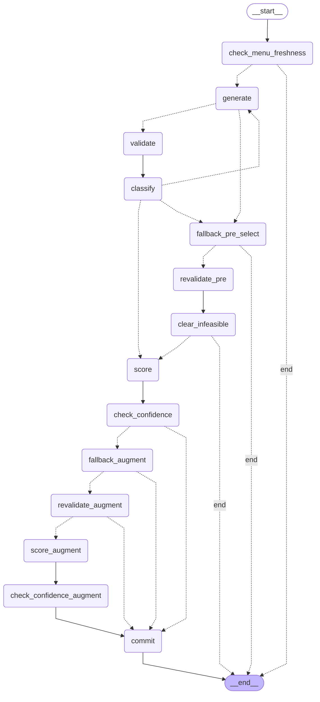

# mess-agent

Agentic AI Mess & Meal Planning System for LNMIIT students. Architecture is **frozen at v3** — see `PROJECT_PLAN.md` and `DECISIONS.md`.

**Live app:** <https://mealpilot-lnmiit.streamlit.app/> · **API docs:** <https://mealpilot-production.up.railway.app/docs>

## What it does

Given a hostel mess menu (uploaded as PDF), a student's onboarding profile (age / weight / activity / goal / dietary preferences / budget), and any canteen items they'd allow, the system:

1. **Ingests the menu** — parses PDF, LLM-extracts dish structure, estimates per-serving macros, admin-verifies before it's live (`menu_intel` agent).
2. **Plans the day** — a LangGraph state machine drafts a plan, deterministic constraint engine validates it against allergies / restrictions / budget / practical serving caps, revises with LLM feedback if needed, commits with a confidence score (`planner` agent).
3. **Tracks meals** — three-button log per meal (`ate planned` / `ate different` / `skipped`). Mid-day replan on divergence; no replan on the golden path.
4. **Fills the gap** — after dinner, if macros are short, suggests canteen add-ons that close the gap within budget (deterministic top-up, no LLM).
5. **Learns preferences** — weekly Learning Agent proposes behavioral facts ("skips peanut butter at breakfast") from meal-log patterns; user approves/rejects via HITL.

## Status

- ✅ **M1 — Foundations:** FastAPI + Supabase RLS + auth + onboarding + nutrition + LLM router + observability tables.
- ✅ **M2 — Menu Intelligence:** PDF ingestion, LLM extraction, macro DB, admin console (upload/approve/verify).
- ✅ **M3 — Planner Agent:** LangGraph state machine, deterministic constraint engine, confidence calculator, plan lifecycle (`draft → sent → superseded`).
- ✅ **M4 — Meal Logging:** append-only logs, idempotent writes, macro tracker, mid-day replan.
- ✅ **M5 (partial) — Canteen top-up + HITL surfaces:** deterministic gap-fill, HITL memory review, mixed-mode planning.
- 144 passing on `main`. (One pre-existing teardown-FK failure in `test_meal_log_endpoint` is tracked separately — unrelated to the planner or agents.)

## Architecture — one line each

- **Three agents:** Planner (LangGraph `StateGraph` — 14 nodes, conditional routing, bounded revision loop) + Menu Intelligence and Learning (linear LLM pipelines). All three share one `agent_runs` / `decision_traces` audit lineage.
- **Everything else is a tool, not an agent:** nutrition math, constraint engine, canteen picker, confidence, memory.
- **Deterministic Python for every number.** LLMs propose; Python validates and computes. Constraint engine has final say before commit.
- **Append-only meal_logs, idempotent writes** (client `event_id` = unique constraint), version-guarded plan writes to survive concurrent replans.

## Planner graph

The Planner is a real `langgraph.graph.StateGraph` compiled per request, invoked via `app.ainvoke(state, {"recursion_limit": …})`. The main spine is **generate → validate → classify → score → check_confidence → commit**. Three failure escapes feed back into the spine: revision loop (bounded by `max_revisions`), pre-select canteen fallback (when mess-only is infeasible), and post-select canteen augmentation (when the winning mess-only plan is too weak). Rendered from `graph.get_graph().draw_mermaid()`:



Node → function wiring lives in `backend/agents/planner_graph.py::_build_planner_graph`; nodes themselves are in `backend/agents/planner_nodes.py`. Side effects (HITL emission, `agent_run` wrap, decision-trace flush) stay in the `run_planner` wrapper so a crash inside the graph can't corrupt the audit trail. Full node-visit sequences for the valid / revise-exhausted / LLM-degraded / no-menu paths are asserted in `tests/test_planner_langgraph.py` (no DB, no LLM).

## Stack

Python 3.11 · FastAPI · LangGraph · Streamlit · Supabase (Postgres + Auth + RLS) · Gemini Flash (primary LLM) + Groq Llama 3.1 (fallback) · pdfplumber · Railway (backend) + Streamlit Community Cloud (frontend).

---

## Try it live

The deployed app runs on Supabase free tier — if the project has been idle for a week it pauses; give it 2 minutes to wake on the first magic-link sign-in.

1. Open <https://mealpilot-lnmiit.streamlit.app/>
2. Enter your email → click **Send magic link**.
3. Click the link in your email. You land back signed in.
4. Fill the onboarding form (age, gender, weight, goal, dislikes, budget). BMR/TDEE/macro targets compute deterministically from Mifflin-St Jeor.
5. On the Today tab, click **Generate / refresh plan** — the planner picks meals from the currently active mess menu that hit your macros.
6. Use the three-button meal log to record what you actually ate. Watch the plan card / macro tracker update.

Admin-only bits (menu PDF upload, macro verification) require `role = 'admin'` on your `public.users` row.

---

## 0. Local development — requirements

- Python **3.11**
- A Supabase project (free tier) — created in §2
- Google AI Studio API key for Gemini (free tier) — used later by the LLM router
- Groq API key (free tier) — fallback provider
- Railway account (optional, only when you're ready to deploy)

---

## 1. Local setup

```powershell
py -3.11 -m venv .venv
.\.venv\Scripts\Activate.ps1
pip install -r requirements.txt
copy .env.example .env
# then fill in .env — see §3
```

---

## 2. Create the Supabase project

1. Go to <https://supabase.com/> → **New project**. Region: closest to India (Mumbai / Singapore).
2. Set a strong DB password (save it — you'll need it for direct psql access).
3. Wait ~2 min for provisioning.
4. Copy the following from **Project Settings**:
   - **API → Project URL** → `SUPABASE_URL`
   - **API → anon public** → `SUPABASE_ANON_KEY`
   - **API → service_role secret** → `SUPABASE_SERVICE_ROLE_KEY`
   - **API → JWT Settings → JWT Secret** → `SUPABASE_JWT_SECRET`

## 3. Fill `.env`

Open `.env` and paste the four Supabase values above. LLM API keys can wait until M2; the backend still starts without them (the router only fires when an agent needs it).

```env
SUPABASE_URL=https://xxxx.supabase.co
SUPABASE_ANON_KEY=...
SUPABASE_SERVICE_ROLE_KEY=...
SUPABASE_JWT_SECRET=...

LLM_PRIMARY_PROVIDER=gemini
LLM_PRIMARY_MODEL=gemini-2.0-flash
LLM_PRIMARY_API_KEY=            # add in M2

LLM_FALLBACK_PROVIDER=groq
LLM_FALLBACK_MODEL=llama-3.1-8b-instant
LLM_FALLBACK_API_KEY=           # add in M2
```

## 4. Apply migrations

Open **Supabase → SQL Editor → New query**. Paste each file in order and Run:

```
backend/db/migrations/0001_extensions.sql
backend/db/migrations/0002_enums.sql
backend/db/migrations/0003_users_profile.sql
backend/db/migrations/0004_preferences_memory.sql
backend/db/migrations/0005_menu_macros.sql
backend/db/migrations/0006_plans_logs.sql
backend/db/migrations/0007_hitl.sql
backend/db/migrations/0008_observability.sql
backend/db/migrations/0009_rls_policies.sql
backend/db/migrations/0010_grants.sql
backend/db/migrations/0011_hitl_enum_fix.sql
backend/db/migrations/0012_menu_intel.sql
backend/db/migrations/0013_weight_logs.sql
backend/db/migrations/0014_plan_cycle_id_used.sql
backend/db/migrations/0015_plan_mode.sql
backend/db/migrations/0016_menu_choice_groups.sql
backend/db/migrations/0017_lock_user_role.sql
```

Each is idempotent (safe to re-run). Or use psql:

```powershell
$env:PG="<paste Direct connection string from Supabase → Database>"
psql $env:PG -f backend\db\migrations\0001_extensions.sql
# ...continue through 0009
```

---

## 5. Run the tests

Unit + local tests (no DB needed):

```powershell
.\.venv\Scripts\python.exe -m pytest tests/test_nutrition.py tests/test_idempotency_keys.py tests/test_auth_jwt.py tests/test_llm_router.py -q
```

Full integration tests (after §3 + §4 are done):

```powershell
# Load .env into the current shell session
Get-Content .env | ForEach-Object { if ($_ -match "^\s*([^#][^=]+)=(.*)$") { [Environment]::SetEnvironmentVariable($matches[1].Trim(), $matches[2].Trim(), 'Process') } }
.\.venv\Scripts\python.exe -m pytest -q
```

DB tests skip cleanly when Supabase env vars are absent.

---

## 6. Run the backend + Streamlit locally

Two shells:

```powershell
# shell A — API
.\.venv\Scripts\Activate.ps1
uvicorn backend.main:app --reload --port 8000
# → http://localhost:8000/docs
```

```powershell
# shell B — UI
.\.venv\Scripts\Activate.ps1
$env:BACKEND_URL="http://localhost:8000"
$env:SUPABASE_URL="<same as .env>"
$env:SUPABASE_ANON_KEY="<same as .env>"
streamlit run frontend\streamlit_app.py
# → http://localhost:8501
```

## 7. Verify end-to-end onboarding

1. Open <http://localhost:8501>.
2. Enter your email → **Send code**. Check inbox for the 6-digit Supabase OTP.
3. Paste code → **Verify**. You are now signed in (an `auth.users` row exists in Supabase).
4. Fill the onboarding form → **Compute targets**. UI shows BMR / TDEE / macros.
5. In Supabase → **Table Editor**, verify:
   - `public.users` has your email + mode
   - `public.user_profile` has your inputs + computed BMR/TDEE/targets
   - `public.user_preferences` has one row per allergy/dislike/restriction/supplement

That's the M1 end-to-end loop.

---

## 8. Deploy

The project is deployed as two services connecting to one Supabase project:

- **Backend (FastAPI)** → Railway. Start command is in `Procfile` for Railpack, mirrored in `railway.toml` for Nixpacks. Env vars are the same as `.env.example` plus `STREAMLIT_URL` (the callback destination after magic-link exchange).
- **Frontend (Streamlit)** → Streamlit Community Cloud. Reads secrets from a TOML block: `BACKEND_URL`, `APP_URL` (backend `/auth/callback`), `SUPABASE_URL`, `SUPABASE_ANON_KEY`, `APP_ENV=production`.
- **Auth flow** — Supabase magic link → backend `/auth/callback` (extracts session token from URL fragment via a static HTML page) → Streamlit with `?rt=…` → refresh-token flow keeps the session across page reloads.

Redirect URLs must be allowlisted in Supabase → Authentication → URL Configuration, including the exact backend callback path (Supabase does path-specific matching, silently falls back to Site URL if unmatched).

---

## 9. Layout

```
backend/
  main.py               FastAPI entry
  config.py             env-backed Settings
  routers/              HTTP endpoints
  auth/                 JWT-verifying dependencies
  db/
    supabase_client.py  service-role + user clients
    migrations/         SQL, applied in order
  idempotency/          key generators + retry-safe writers
  tools/
    nutrition.py        deterministic §10 math
    llm_router.py       primary+fallback+degraded-mode
    trace.py            agent_runs / tool_calls / decision_traces writers
  models/               Pydantic schemas (PlannerState, Plan, ValidationResult, ...)
frontend/
  streamlit_app.py      student UI
  admin_app.py          M2+ placeholder
tests/                  unit + integration (DB tests skip when unset)
```

Nothing in this layout is designed for extension in M1 — it's exactly what §23 of the frozen plan specifies.
